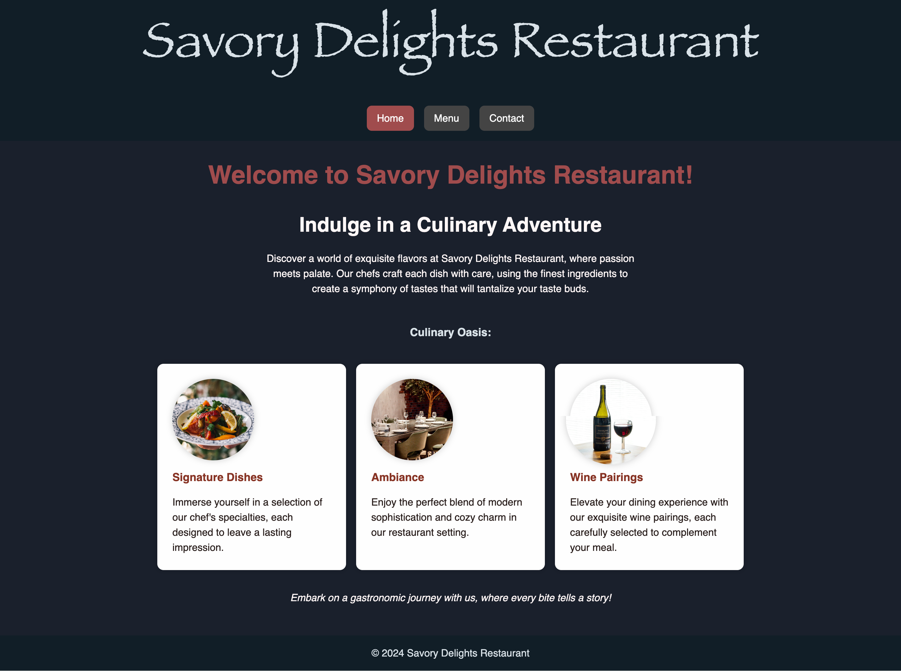

# The Odin Project - Restaurant Page

This is a project from the Odin Project's curriculum. The goal is to create a simple restaurant page landing using JavaScript to render the entire contents of the website.

## Built With

- HTML
- CSS
- JavaScript
- Webpack
- Webpack loaders: style-loader, css-loader, file-loader, html-loader

## Features

- The website is a single page application
- The website has a navigation bar
- The website has a home page, menu page, and contact page
- The website has a header, footer, and main content
- When the user clicks on the navigation bar, the website will render the corresponding page

## Screenshot

## Live Demo

[Live Demo Link](https://odinproject-resturant-landing.netlify.app/)

## Getting Started

To get a local copy up and running follow these simple example steps.

### Prerequisites

- Web Browser
- Node.js
- code editor

### Setup

- Clone the repository
- Open the terminal
- Change directory to the folder where you cloned the repository
- Run `npm install` to install the dependencies

### Usage

- Run `npm run build` to build the project
- Alternatively, run `npx webpack` to build the project
- You can also run `npm run watch` to build the project and watch for changes
- Open the `dist/index.html` file in your web browser

## Authors

👤 **Robert Ramirez**

- LinkedIn: [Robert Ramirez](www.linkedin.com/in/roberto-ramirez-aguilar)